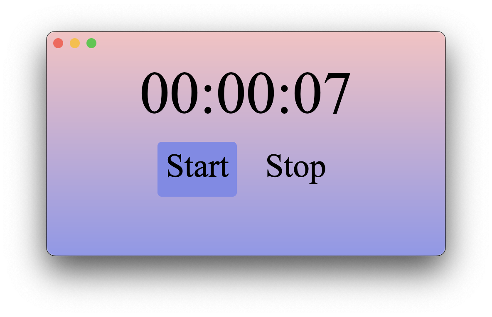

 

## Overview

This is the special branch of wry to experiment Servo, a web engine written mostly in Rust, as a crate dependency.
The motivation of this experiment is evaluating custom web egines that can be fully under our control and be customized at will.
And at the same time, finding the root cause and pivot point that could really improve and help web and rust community moving forward.
Servo fits into this position pretty well because it isn't controlled by any huge corporation. Evryone from the open source community is free to shape the project together.
While it doesn't provide full coverage of all web features yet, it already offers super flexible interface to work with.
In this branch, we showcase how to integrate and customize it to become a modern style landing page.

# Usage

- Clone this repository
- build the project `cargo build`
- run the demo `cargo run --example servo`

# Note

`demo-servo` is my local branch where I experiment with embedding Wry and Servo. I have also customized it accordingly. You should check out [`servo-wry-demo`](https://github.com/tauri-apps/wry/tree/servo-wry-demo) for the original demo from the Wry team.
